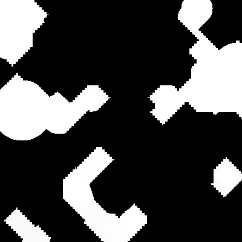

# Implement a Morphological Gradient

A morphological gradient is an operation that calculates the difference between the dilation and erosion of an image. It can be used to emphasize the edges of an image, making it useful for edge detection. In this sub-challenge, you will apply a morphological gradient operation to the binary image generated by `generate_binary_image` function.

## Requirements:

- Use different structuring elements (rectangular, elliptical, cross-shaped) and sizes.

## TODO:

Please complete the `apply_morphological_gradient` function in the file `/home/labex/project/apply_morphological_gradient.py`. 

1. The `apply_morphological_gradient` function takes the following parameters:
   - `image`: The binary image generated in Sub-Challenge 1.
   - `kernel_shape`: The shape of the structuring element ("rectangular", "elliptical", or "cross").
   - `kernel_size`: The size of the structuring element.
2. Apply the morphological gradient operation using the provided parameters.
3. Use the `cv2.getStructuringElement` function and the `cv2.morphologyEx` function.
4. Return the processed image.

## example
Take `apply_morphological_gradient(image, "cross", 5)` as an example to process the target binary image.
- The shape of the structuring element is "cross".
- The size of the structuring element is 5.

```python
image = cv2.imread("example_image.jpg", cv2.COLOR_BGR2GRAY)
result = apply_morphological_gradient(image, "cross", 5)
```

The image processing result is as follows:


                       
You can compare the difference between it and before it was processed. 

The original image before processing looks like this:


